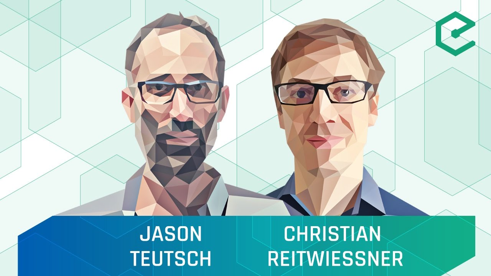

# Truebit Roadmap

The current repo will house the design documents, Truebit's roadmap, the links to useful resources and other material related to or useful for Truebit.

## Table Of Contents

- [Overview](#overview)
  - [Roles](#roles)
  - [Components](#components)
- [Announcements](#annoncements)
- [Imposed Limitations](#imposed-limitations)
- [Quick Summary](#quick-summary)
- [Proof of Concept](#proof-of-concept)
- [Community](#community)
- [Project Links](#project-links)
- [Resources](#resources)

## Overview

The short version is Truebit is an incentivized scalability solution for distributed trustless networks. 
The protocol is enforced by playing an interactive "game". The interactive game involes certain roles and pieces of software that comproise the truebit protocol. 
Before we see what "playing the game" means lets first look at some definitions: 
First we'll definge the roles: 

### Roles
* Taskgiver: is the miner posting a task that requires verification on whether or not the task was carried out correctly by the Solver. 
* Solver: is the miners chosen to run the task for a reward. 
* Verifier(s): are the miners that check the task and it's computation posted to the blockchain by the solver. 
* Challenger(s): are the verifiers that see a mismatch between the hashes of the Truebit machine posted on the blockchain by the solver and their own hashes of the internal state of the truebit machine generated by the truebit offline interpreter. 
* Referees(s): are the miners that will oversee the time-outs imposed on the verification game while the solver is solving the task and verifiers are verifying it. 
* Judges(s): are the miners 

### Components
* Off-chain Interpreter: is the off-chain truebit [WASM](https://github.com/WebAssembly/) machine that runs a WASM object file and generates merkle proofs of the internal state of the machine. 
* On-chain Interpreter: is the WASM interpreter written in Solidity. Same functionality as off-chain interpreter but all computations done on the blockchain. 
* Truebit Contracts: there are separate contracts for TaskGiver, Solver, and Verifier. Each contract is in charge of the balances for each user. A user can submit a deposit to one of these smart contracts and then use the contract methods to participate in the TrueBit protocol. 
* Dispute Resolution Layer: At the heart of TrueBit’s protocol lies an interactive “verification game” which decides whether or not a contested computational task was performed correctly. The verification game proceeds through a series of rounds, where each round recursively checks a smaller and smaller subset of the computation. A trusted network, in our case the Ethereum platform , merely enforces the rules of the game and therefore does not bear the bulk of the verification burden. 
* Incentive Layer: The economics behind TrueBit are similar to cloud services. Alice pays Amazon for computing power. TrueBit allows Alice, the task giver, to pay anyone on the network like Bob. In order to ensure Bob, the solver, actually solves the task correctly. Bob allows for his solution to be challenged by a Verifier. Since the probability of actually finding an error is low, TrueBit's incentive layer offers bug bounties and provides the expectation that there will be bugs to find. TrueBit randomly forces a Solver to submit an incorrect solution to be checked by verifiers. If a verifier finds that Bob submitted an incorrect solution they will be compensated while Bob will be punished. 

## Announcements

## Imposed Limitations
* External Calls: external calls are a source of non-deterministic execution. Truebit needs the task to be deterministic so that the solver and verifier can both run the exact same internal states for the same task. For an example of how external calls yield different internal states, think of the pid of the child process returned by the `fork` system call or a random generator function. It could be argued that the non-determinism introduced by the external calls can be "local" and does not affect the final outcome of the task and hence is mitigatable to some extent. For the proof of concept however, Truebit will not try to tackle this issue. 
* Floating-Point: WASM's specification allows some nondeterminism for floating-point arithmetic. The solver originally runs the task using any WASM build toolchain. Needless to say we cannot gurantee the toolchains used will behave the same when it comes to the non-determinism in floating-point arithmetic. 

## Quick Summary

## Proof Of Concept

## Community
* [Slack](https://truebit.slack.com/messages/C5G74SV6V/) 
* [Reddit](https://www.youtube.com/redirect?redir_token=cWQgq0FMKvmnIJFWyAc8msETA0V8MTUwNTk5ODI3MkAxNTA1OTExODcy&event=desc&q=https%3A%2F%2Fwww.reddit.com%2Fr%2Ftruebit%2F) 

  

## Project Links
* [Truebit Website](https://truebit.io) 
* [Ocaml Off-chain Interpreter](https://github.com/TrueBitFoundation/ocaml-offchain) 
* [On-chain Interpreter](https://github.com/TrueBitFoundation/webasm-solidity) 
* [Incentive Layer Contracts](https://github.com/TrueBitFoundation/truebit-contracts) 
* [Scrypt-Interactive](https://github.com/TrueBitFoundation/scrypt-interactive) 
* [Python Off-chain Interpreter](https://github.com/TrueBitFoundation/python-offchain) - DEPRECATED 

## Resources
* [Truebit Whitepaper](https://people.cs.uchicago.edu/~teutsch/papers/truebit.pdf)
